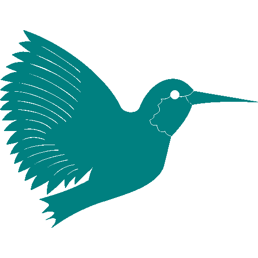

### Hi there, I'm Shah 👋

## I'm an Engineer, and I like helping people!

### 🤝 Connect with me:

 

---

### 👨‍💻 Programming Languages:
 

[<code></code>](https://en.wikipedia.org/wiki/C_(programming_language))
[<code></code>](https://en.wikipedia.org/wiki/C%2B%2B)
[<code></code>](https://en.wikipedia.org/wiki/JavaScript)
[<code></code>](https://www.python.org/)
[<code></code>](https://www.java.com/)
[<code></code>](https://www.arduino.cc/)
[<code></code>](https://www.mathworks.com/products/matlab.html)

 

---

### 👨‍💻 Frontend Development:
 

[<code></code>](https://en.wikipedia.org/wiki/HTML)
[<code></code>](https://en.wikipedia.org/wiki/CSS)
[<code></code>](https://react.dev/)
[<code></code>](https://redux.js.org/)

 

---

### 👨‍💻 Backend Development:
 

[<code></code>](https://nodejs.org/)
[<code></code>](https://flask.palletsprojects.com/)
[<code></code>](https://nginx.org/en/)

 

---

### 👨‍💻 Databases:
 

[<code></code>](https://www.sqlite.org/index.html)
[<code></code>](https://firebase.google.com/?gad=1&gclid=CjwKCAjwjaWoBhAmEiwAXz8DBZNF5IMYUuOmKXDPLc9b3ZDH36N3IcB7HOj5z9JuYYeI-dHdE1k3eBoCz3EQAvD_BwE&gclsrc=aw.ds)

 

---

### 👨‍💻 Developer Tools:
 

[<code></code>](https://www.gnu.org/software/bash/)
[<code></code>](https://git-scm.com/)
[<code></code>](https://code.visualstudio.com/)
[<code></code>](https://www.vim.org/)
[<code></code>](https://www.docker.com/)
[<code></code>](https://www.latex-project.org/)
[<code></code>](https://www.cloudflare.com/)

 

---

### 👨‍💻 Operating Systems:
 

[<code></code>](https://www.microsoft.com/en-us/windows)
[<code></code>](https://ubuntu.com/)
[<code></code>](https://www.raspberrypi.com/software/)

 

---

### 👨‍💻 Security:
 

[<code></code>](https://www.wireshark.org/)
[<code></code>](https://www.ghidra-sre.org/)

 

---

### 👨‍💻 Software:
 

[<code></code>](https://www.adobe.com/products/photoshop.html)
[<code></code>](https://www.adobe.com/products/illustrator.html)
[<code></code>](https://www.figma.com/)

 
